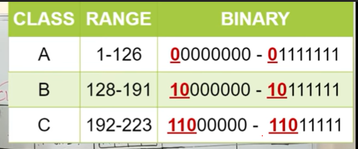
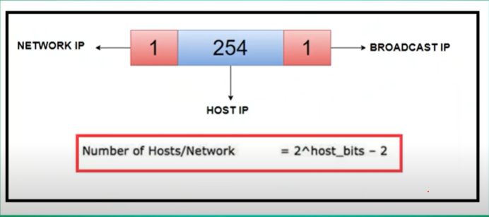
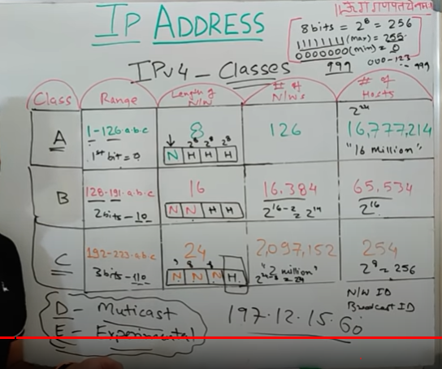

# IPv4

1 byte = 8 bits  = **1 octet**

IPv4 works on the **Network layer**

Each octet can have values ranging from 2^0 to 2^8 \(**1 to 255**\)

Max address is 255.255.255.255

**IPv4 has 4 octets** i.e 4 bytes or 32 bit dotted decimal

**Class of IP address** shows the division into **Network ID + Host ID**

**Private IPs** 10.0.0.0, 172.16.0.0, 192.168.0.0 - used locally

