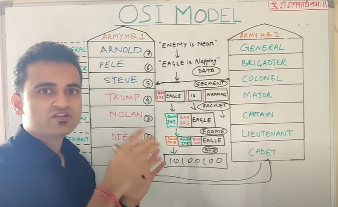
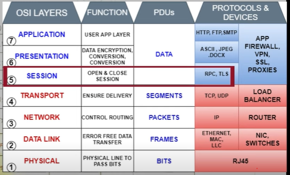
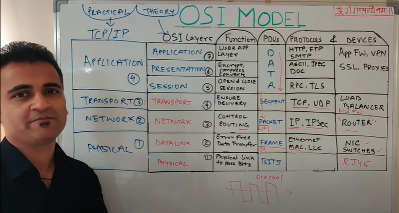

# OSI Model

Mnemonic - **all people seem to need data processing**

| **OSI** |
| :--- |
| Application Layer \(data\) |
| Presentation layer \(encrypted data\) |
| Session Layer \(session connection - simplex/duplex\) |
| Transport Layer \(segment\) |
| Network Layer \(packet \) |
| Data Link Layer \(frames + MAC header\) |
| Physical Layer \(bits\) |

**TCP/IP MODEL**

